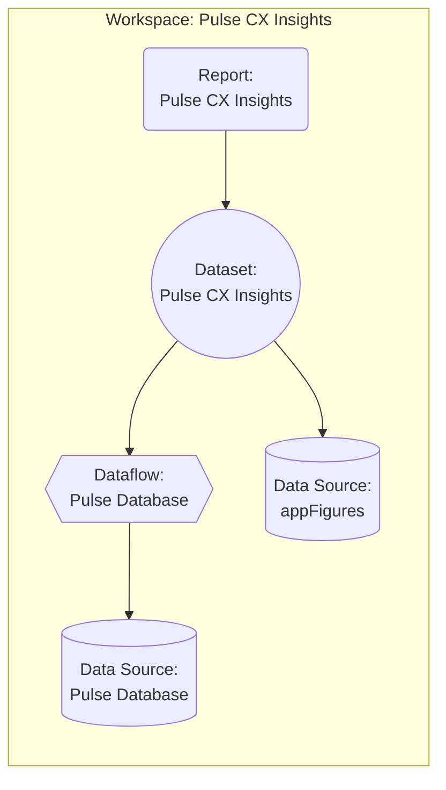

# Example Page!

This is another example page.

```go
// You can edit this code!
// Click here and start typing.
package main

import "fmt"

func main() {
	fmt.Println("Hello, 世界")
}
```



## Shell Prompt

```bash{promptUser: alice}{promptHost: dev.localhost}
ls --color=auto
```

## C# Code

```csharp
public class Example
{
	public override string ToString()
	{
		return "EXAMPLE";
	}
}
```